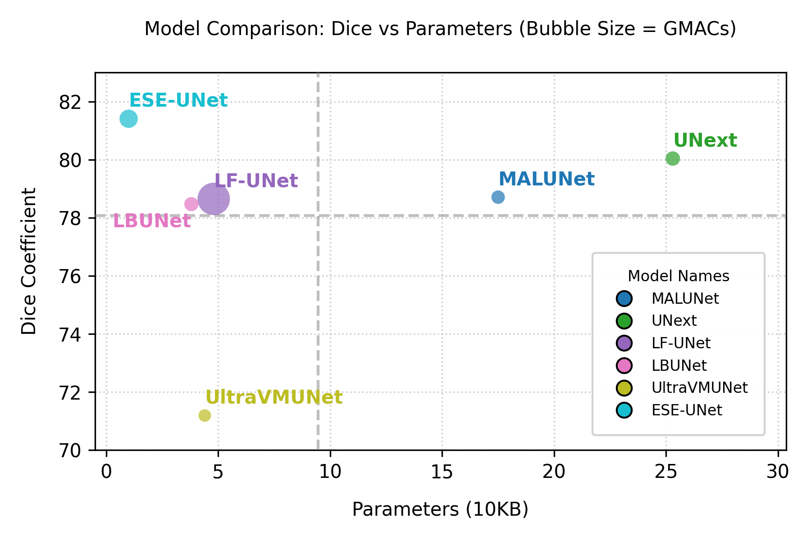
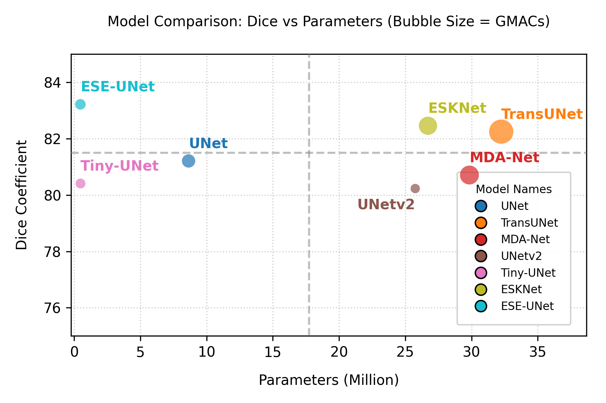

# ESEUNet
This is the official implementation of ESEUNet, which is derived from SimpleUNet.

  

  
Compared to the SOTA lightweight and heavy models, our ESE-UNet remains dominant.

  

    

      
      
 ESE-UNet is light yet better when compared to the latest LBUNet, UltraVMUNet.
    

    

      
      
ESE-UNet remains favourable when compared to UNet, Tiny-UNet, UNetv2, ESKNet, and TransUNet.
    

  

