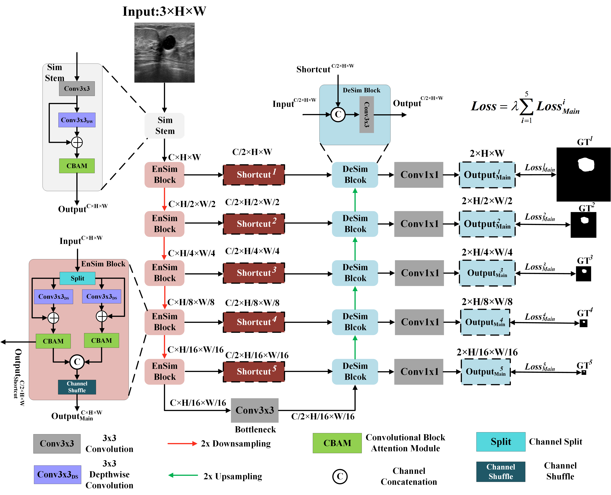

# ESEUNet
This is the official implementation of ESEUNet, which is derived from SimpleUNet.

  

  
Compared to the SOTA lightweight models, our ESE-UNet remains dominant.

|  |  |
|:---:|:---:|
|ESE-UNet vs Lightweight SOTA| ESE-UNet vs Heavyweight SOTA|

  

    

      
      
 ESE-UNet is light yet better.
    

    

      
      
ESE-UNet remains favourable.
    

  

